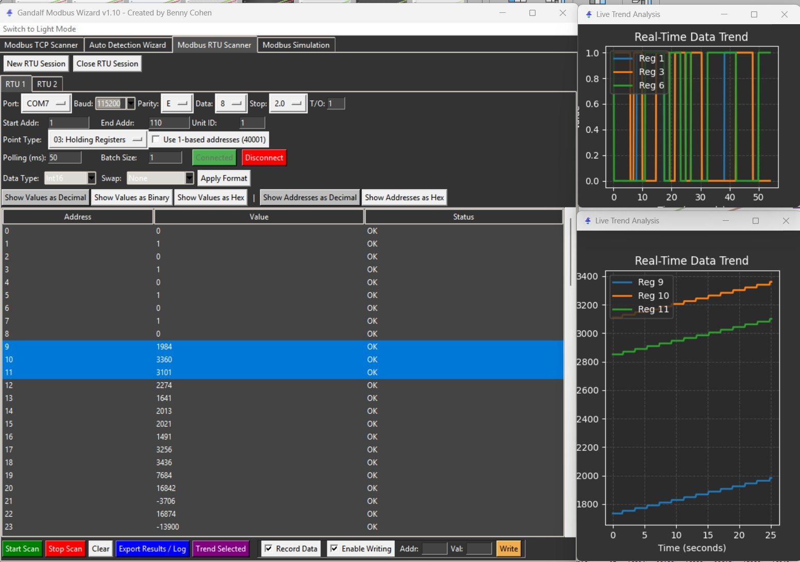
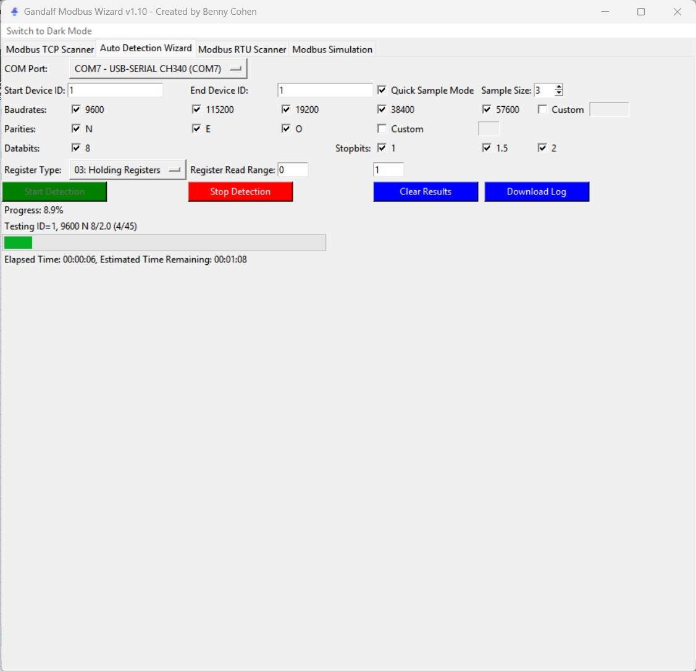
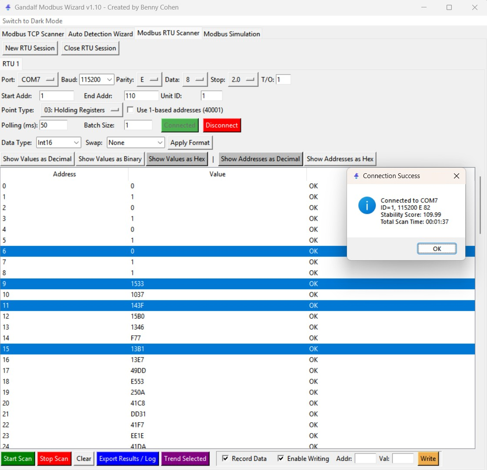
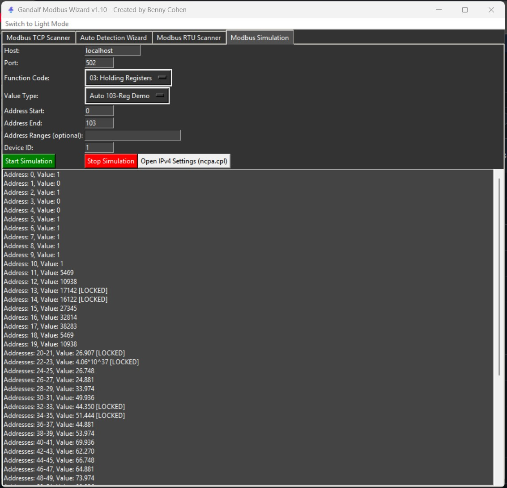
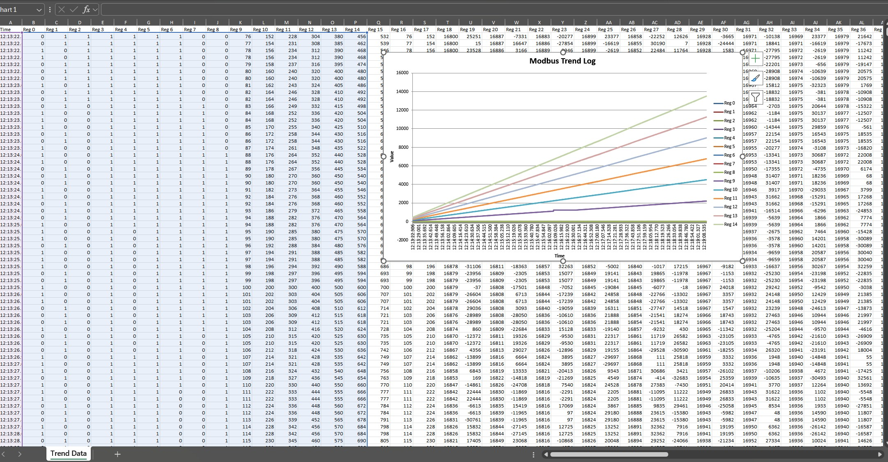
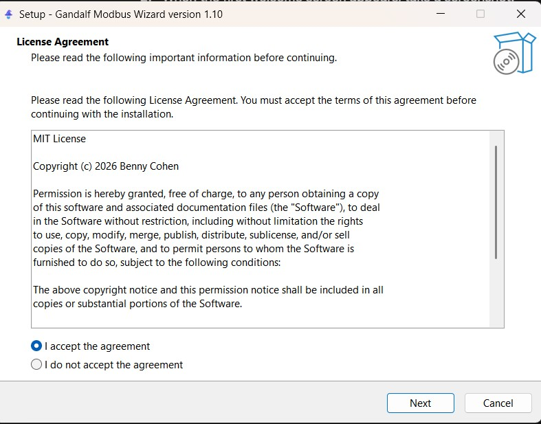

# Gandalf Modbus Wizard 🧙‍♂️

**Gandalf Modbus Wizard** is a comprehensive, free utility designed to facilitate the scanning, troubleshooting, and simulation of Modbus TCP and Modbus RTU devices.

*Designed by an engineer, for engineers—to take the guesswork out of serial communications.*

---

## ☕ Support the Project
This tool is completely free to use. However, it takes significant personal time to develop and maintain. If this wizard helps you solve a tricky connection issue or saves you time in the field, please consider supporting the project!

[**☕ Buy Me a Coffee**](https://buymeacoffee.com/bennycohen)

---

## 📺 Video Tutorial
**📢 NOTE: New video tutorial featuring the Live Trend and v1.10 features is coming soon!**

In the meantime, the core concepts from the previous version's guide still apply:

---

## ✨ Features

### 📈 Live Trend Analysis (New!)
Visualize your data in real-time to diagnose stability issues or tune loops.
* **Real-time Graphing:** Select specific registers to plot values instantly.
* **PID Tuning Helper:** Perfect for visualizing PV (Process Variable), SP (Setpoint), and OP (Output) simultaneously.
* **Dynamic Theme:** Charts automatically adapt to Dark Mode.

---

### 🔍 Auto Detection Wizard
Stop guessing your connection settings. This feature brute-forces combinations to automatically detect the correct parameters for your Modbus RTU device.
* **COM Port:** Select your target port.
* **Scan Range:** Define the Device ID range to probe.
* **Parameters:** Automatically cycles through Baud Rates, Parities, Data Bits, and Stop Bits.

---

### 🔌 Modbus RTU Scanner
Once your connection is established, use the RTU Scanner to visualize data.
* **Relaxed Timing:** Now supports **1.5 Stop Bits** for improved stability with Arduino/Embedded devices.
* **Control:** Write directly to registers from the interface.
* **Visuals:** Combine consecutive registers (Normal / Reverse) for 32-bit values.

*Connection Success details are now clearly visible:*

---

### 🌐 Modbus TCP Scanner
Connect to and diagnose Modbus TCP devices over a network.
* **Connection:** Localhost or target IP (Default Port 502).
* **Flexibility:** Custom polling rates and Start / End address ranges.
* **Data Formatting:** Combined registers in Normal or Reverse order.

---

### 🎮 Modbus Simulation
Need to test a SCADA or HMI client? Spin up a virtual device instantly.
* **Robust Engine:** Completely rewritten threaded engine to prevent stalls.
* **Manual Overrides:** Writing to a register now "Locks" the value (indicated by `[LOCKED]`), preventing the auto-generator from overwriting your test data.
* **Simulation:** Generates valid Modbus responses for client testing.

---

## 🚀 What's New in Version 1.10

### Major Features

📈 **Live Trend Graphing**
Added a popup real-time chart. Select any rows in the scanner grid and click **"Trend Selected"** to visualize data over time. Essential for diagnosing intermittent sensor issues or PID loop behavior.

📊 **Excel Export with Charts**
Export your scan history directly to an Excel file. The wizard now automatically generates a line chart for the first 15 registers in your log!

📦 **Full Windows Application**
Gandalf has graduated to a standalone Windows Application. The installer handles all dependencies—no Python knowledge required.

### Critical Fixes & Improvements

🛡️ **Simulation Race Condition Fix**
Rewrote the Simulation Server to use **Thread Locking**. This eliminates the "Input/Output" error and application stall that occurred when writing values to the simulator during a scan.

🔌 **RTU Stability Update**
Added support for **1.5 Stop Bits** logic. This fixes framing errors and connection drops commonly seen with Arduino, ESP32, and other embedded Modbus slaves that have slight timing jitters.

✍️ **Float Value Support**
Fixed an issue where writing Float values to registers was not parsing correctly. You can now write 32-bit floating point numbers to supported devices seamlessly.

🌙 **Dynamic Dark Mode**
The Live Trend charts now respect the global Dark Mode setting, switching to a dark background and white axis text automatically.

---

## 🚀 Getting Started

### Option 1: Windows Installer (Recommended)

1. **Download:**
   Get the latest installer from the official release page:
   👉 https://github.com/Bennyco86/Gandalf-Modbus-Wizard/releases/tag/v1.10

2. **Install:**
   Run `Gandalf_Wizard_Setup.exe` and follow the setup wizard.
   
   

3. **Launch:**
   Start Gandalf Modbus Wizard from the Desktop or Start Menu.

---

## 🤝 Support & Contribution

If you find value in Gandalf Modbus Wizard, your support is greatly appreciated. It helps drive continued development and feature improvements.

---

### Contributing
Please read [CONTRIBUTING.md](CONTRIBUTING.md) for details on the code of conduct and how to submit pull requests.

---

### Credits & License
If you share this software, please credit **Benny Cohen**.
This project is licensed under the **Gandalf Modbus Wizard License** – see [LICENSE.md](LICENSE.md) for details.