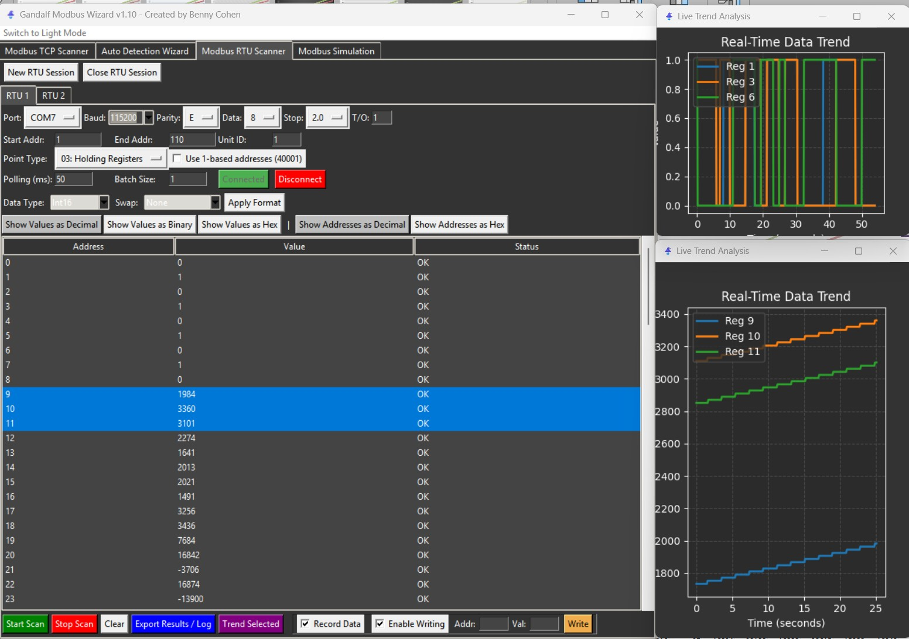
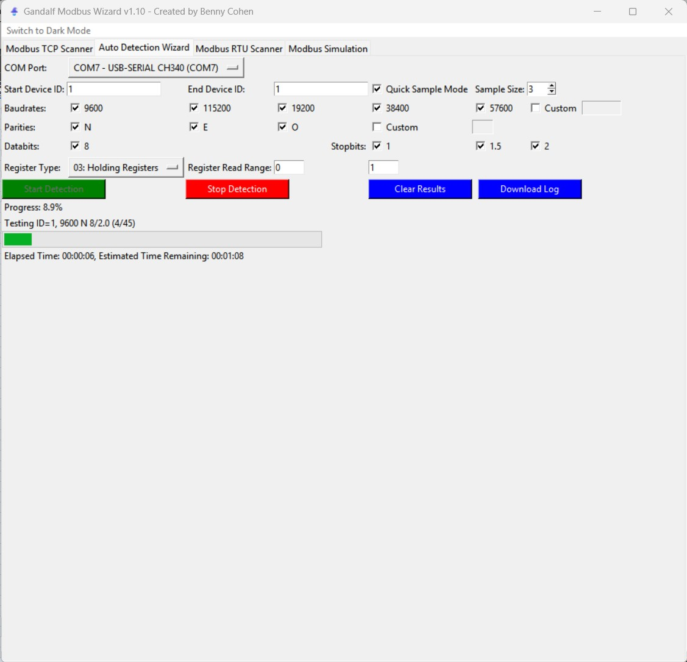
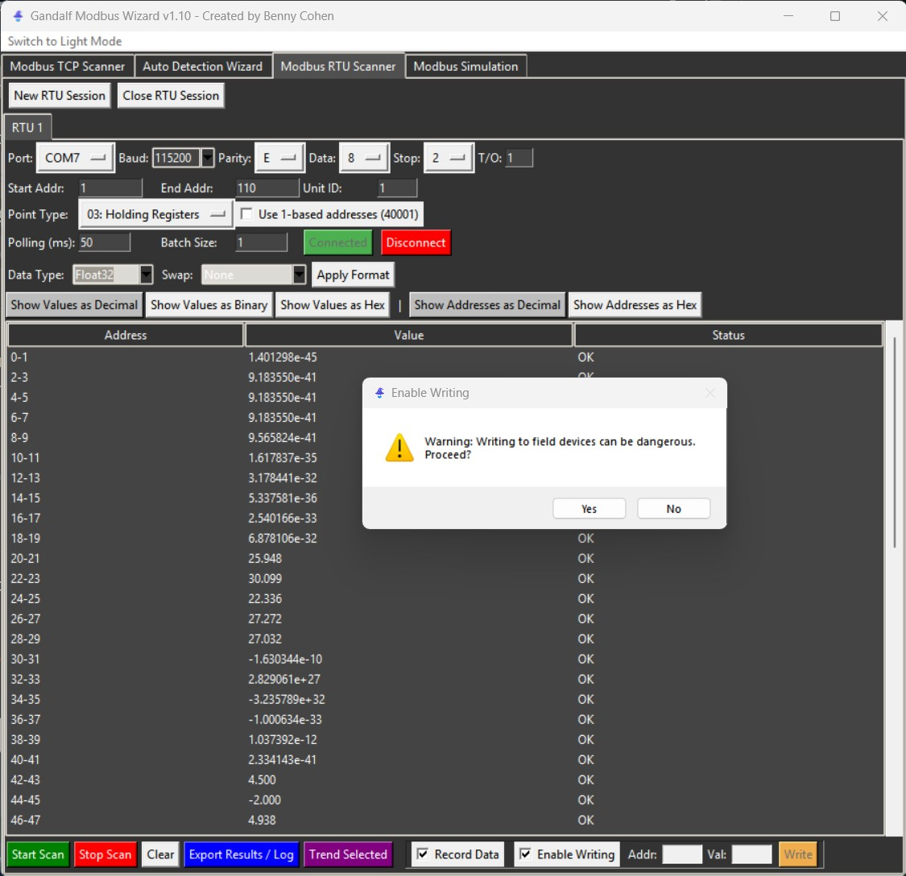
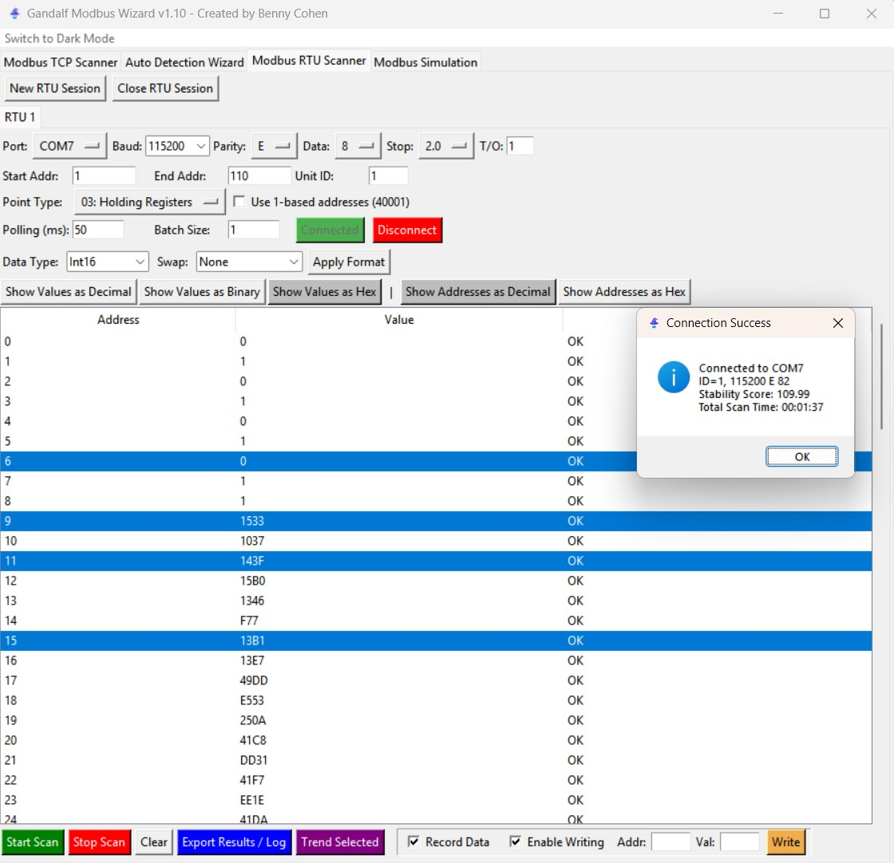
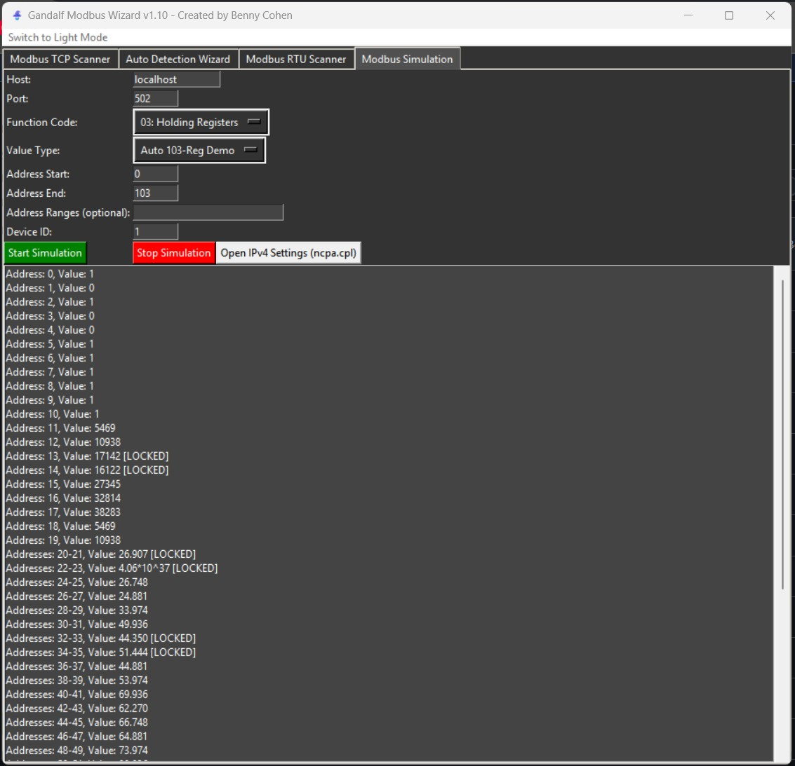
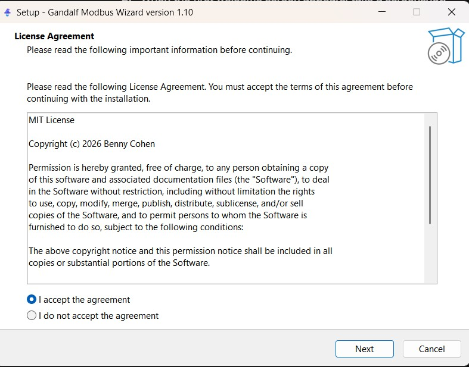

# Gandalf Modbus Wizard 🧙‍♂️

[](https://github.com/Bennyco86/Gandalf-Modbus-Wizard/releases/tag/v1.13)
[](https://buymeacoffee.com/bennycohen)

**Gandalf Modbus Wizard** is a comprehensive, free utility designed to facilitate the scanning, troubleshooting, and simulation of Modbus TCP and Modbus RTU devices.

*Designed by an engineer, for engineers—to take the guesswork out of serial communications.*

---

## ☕ Support the Project
This tool is completely free to use. However, it takes significant personal time to develop and maintain. If this wizard helps you solve a tricky connection issue or saves you time in the field, please consider supporting the project!

[**☕ Buy Me a Coffee**](https://buymeacoffee.com/bennycohen)

---

## 📺 Video Tutorial
**📢 NOTE: New video tutorial featuring the latest UI + diagnostics (v1.12) is coming soon!**

In the meantime, the core concepts from the previous version's guide still apply:

[](https://www.youtube.com/watch?v=Xit_uzv_hek)

---

## ✨ Features

### 📈 Live Trend Analysis
Visualize your data in real-time to diagnose stability issues or tune loops.
* **Real-time Graphing:** Select specific registers to plot values instantly.
* **PID Tuning Helper:** Perfect for visualizing PV (Process Variable), SP (Setpoint), and OP (Output) simultaneously.
* **Dynamic Theme:** Charts automatically adapt to Dark Mode.



---

### 🔍 Auto Detection Wizard
Stop guessing your connection settings. This feature brute-forces combinations to automatically detect the correct parameters for your Modbus RTU device.
* **COM Port:** Select your target port.
* **Scan Range:** Define the Device ID range to probe.
* **Parameters:** Automatically cycles through Baud Rates, Parities, Data Bits, and Stop Bits.



---

### 🔌 Modbus RTU Scanner
Once your connection is established, use the RTU Scanner to visualize data.
* **Relaxed Timing:** Now supports **1.5 Stop Bits** for improved stability with Arduino/Embedded devices.
* **Control:** Write directly to registers from the interface.
* **Visuals:** Combine consecutive registers (Normal / Reverse) for 32-bit values.



*Connection Success details are now clearly visible:*


---

### 🌐 Modbus TCP Scanner
Connect to and diagnose Modbus TCP devices over a network.
* **Connection:** Localhost or target IP (Default Port 502).
* **Flexibility:** Custom polling rates and Start / End address ranges.
* **Data Formatting:** Combined registers in Normal or Reverse order.

---

### 🎮 Modbus Simulation
Need to test a SCADA or HMI client? Spin up a virtual device instantly.
* **Robust Engine:** Completely rewritten threaded engine to prevent stalls.
* **Manual Overrides:** Writing to a register now "Locks" the value (indicated by `[LOCKED]`), preventing the auto-generator from overwriting your test data.
* **Simulation:** Generates valid Modbus responses for client testing.



---

## What's New in Version 1.13

**Release link:** https://github.com/Bennyco86/Gandalf-Modbus-Wizard/releases/tag/v1.13

### Fixes & Improvements
* **Float64 Excel Export:** Fixed export failure when scanned values contained `NaN` or `Inf`.
* **Tab Readability:** Fixed small notebook tab font and stabilized tab sizing.
* **Diagnostics Resource Use:** Network Diagnostics monitoring now starts OFF by default and runs only when enabled.
* **Responsiveness:** Reduced UI lag when switching pages by skipping heavy redraw work on hidden tabs.
* **Overall Stability:** Improved background update behavior during active scans and simulation.

---
## What's New in Version 1.12.2 (Previous)

**Release link:** https://github.com/Bennyco86/Gandalf-Modbus-Wizard/releases/tag/v1.12.2

### Fixes & Updates
*   **Linux Stability:** Fixed a crash on startup for Linux/WSL users caused by a missing Pillow/Tkinter dependency (`PIL._tkinter_finder`).
*   **Windows Installer:** Updated packaging to ensure all latest dependencies are bundled correctly.
*   **Verified:** Live Trending feature verified working on both Windows and Linux.

---

## What's New in Version 1.12 (Previous)

### Major Features
*   **RTU over TCP (RTU Tunnel):** Added support for RTU frames over TCP sockets (no MBAP header).
*   **Proxy Helper:** Included `rtu_over_tcp_proxy.exe` for local testing.

## What's New in Version 1.11 (Previous)

### Major Features
*   **UI Overhaul:** Modern flat UI, Dark/Light theme, DPI-aware.
*   **Network Diagnostics:** Traffic Monitor and CRC16 Calculator.
*   **Enhanced Auto-Detection:** Faster algorithms for embedded devices.
*   **Save Config:** JSON save/load for RTU settings.

---

## 🚀 Getting Started

### Option 1: Windows Installer (Recommended)

1. **Download:**
   Get the latest installer from the official release page:
   https://github.com/Bennyco86/Gandalf-Modbus-Wizard/releases/tag/v1.13

2. **Install:**
   Run `Gandalf_Wizard_Setup_v1.13.exe` and follow the setup wizard.

   

3. **Launch:**
   Start Gandalf Modbus Wizard from the Desktop or Start Menu.

### Option 2: Linux / WSL

1. **Download:**
   Get the `.deb` package from the release page.

2. **Install:**
   ```bash
   sudo dpkg -i gandalf-modbus-wizard_1.13_amd64.deb
   sudo apt-get install -f  # If dependencies are missing
   ```

3. **Launch:**
   Run `gandalf-modbus-wizard` from your terminal or application launcher.

---

## 🤝 Support & Contribution

If you find value in Gandalf Modbus Wizard, your support is greatly appreciated. It helps drive continued development and feature improvements.

[](https://buymeacoffee.com/bennycohen)

---

### Credits & License
If you share this software, please credit **Benny Cohen**.
This project is licensed under the **Gandalf Modbus Wizard License** included with the release packages.


